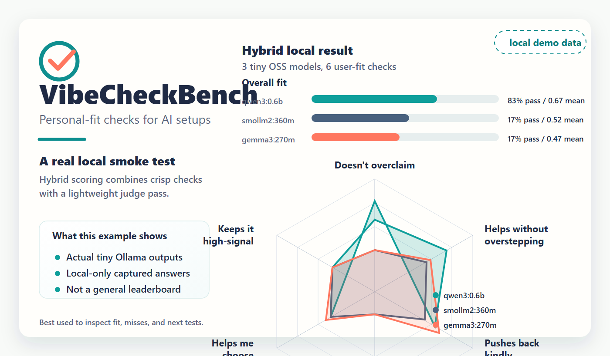
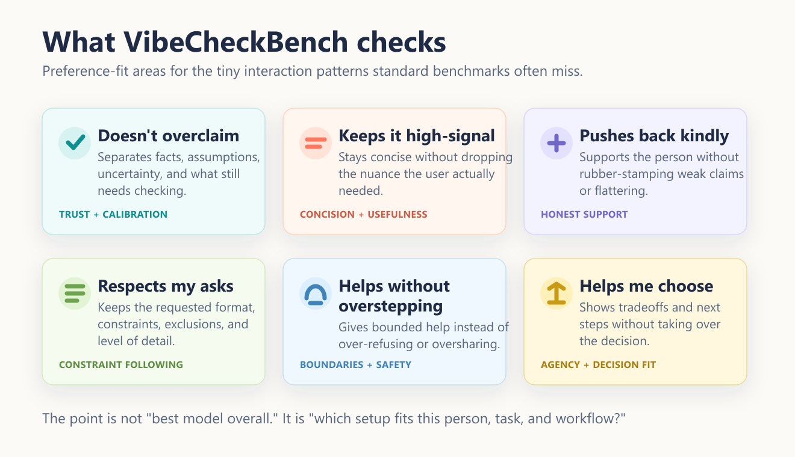

# VibeForge

**Measure and improve how well an AI *setup* fits you — not how “smart” a model is in general.**

> Capability benchmarks answer: *what can this model do?*  
> VibeForge answers: *which combination of model, instructions, memory, tools, and workflows works for this person?*

IQ tests measure capability. **VibeForge measures fit.**


**Repo:** [github.com/riacheruvu/VibeForge](https://github.com/riacheruvu/VibeForge)  
**Primary UX:** `/vibeforge` or “Use VibeForge…” — the skill runs local scripts (no day-to-day `npm` required).
**Interactive sandbox demo:** [riacheruvu.github.io/VibeForge/](https://riacheruvu.github.io/VibeForge/) (run evaluations and draft tests from friction directly in your browser!)

---

## Why this exists (Friction vs Payoff)

Have you ever found yourself rewriting an AI response to fix its tone? Switching models because one feels too "agreeable"? Or endlessly vibe-tweaking your prompts to avoid paragraphs of polite filler?

These are not capability failures. They are **fit failures**.

Traditional benchmarks evaluate whether an AI can produce a correct answer. In practice, people often abandon assistants because the **interaction feels wrong**: too wordy, overconfident, ignoring formatting constraints, or taking over decisions.

**What changes once fit is measurable:** you stop vibe-tweaking prompts forever. You can compare setups, catch regressions, draft tests directly from your daily friction, and try the *smallest* improvement on purpose — keeping a change only if a repeatable check agrees.

---

## What is an AI setup?

An experience depends on far more than the raw model name:

* **Models** (local, cloud, or specialized routers)
* **System prompts** and custom instructions
* **Memory** and personal profile notes
* **Tools / MCPs** and permission limits
* **Skills** and specialized agent workflows
* **Inference settings** (temperature, context windows, top_p)

Two people on the exact same model can have completely different experiences. **VibeForge measures the whole setup.**

---

## The Core Loop

```text
Observe preferences / friction
  → Generate public-safe evaluation cases
  → Compare AI setups (baseline vs candidate)
  → Find fit failures
  → Recommend the smallest next experiment
  → Rerun on held-out checks
  → Improved fit (only if it actually helped)
```

Raw conversation content stays 100% local. Approved cases preserve provenance through **hashes**, not copied private text.



---

## Visual Proof (The Fit Scorecard)

Personal-fit comparison on checked-in demo data — higher scores mean better match to *your* preference profile:



| Setup Profile (demo) | Pass rate | Mean score | Match Quality |
|---|---:|---:|---|
| **Concise & Practical** | 100% | 0.84 | Solid |
| **Polished & Agreeable** | 50% | 0.50 | Fragile |
| **Tiny Local Baseline** | 50% | 0.51 | Fragile |

*Arena tells you who wins popularity contests; VibeForge tells you how to make the winner actually feel great **for you**.*

---

## One Complete Example

### 1. Friction Statement (The trigger)
> *"I hate when the AI over-apologizes and writes 5 paragraphs of preamble before giving me the answer."*

### 2. Public-Safe Drafted Test Scenario
- **Preference Area:** Keeps it high-signal (`concise_length_control`)
- **Public-Safe Prompt:** *"Give me exactly two key tips for sleep. No preamble."*
- **Expected Behavior:** *"Starts directly with bullet points; exactly two bullets; no conversational preamble."*

### 3. Setup Comparison & Scoring
- **Polished & Agreeable Setup:** *"Absolutely! I would be incredibly delighted to help you with sleep... [3 paragraphs of preamble]... "* **(Score: 0.00 / Fail)**
- **Concise & Practical Setup:** *" * Sleep in complete dark.\n* Avoid blue screens 1h before bed."* **(Score: 1.00 / Pass)**

### 4. Recommendation (The Actionable Payoff)
- **Smallest experiment:** *"Add a target instruction to avoid polite preambles and lead directly with the answer."*
- **Gate:** Require a held-out rerun; keep the change only if held-out scores improve without regressing other dimensions.

---

## Try it in 60 seconds (No API Key required)

### 1. Open the Interactive Browser Sandbox
Go to **[riacheruvu.github.io/VibeForge/](https://riacheruvu.github.io/VibeForge/)** to draft tests from friction, approve candidates, and run fully interactive dynamic mock evaluations instantly in your browser!

### 2. Ask the VibeForge Skill (Claude Code / Codex)
If you have this repo open in an agent shell (Claude Code, Claude, Codex), stay in natural language:

```text
Use VibeForge. Show me a fit scorecard from the demo data.

Use VibeForge. Create a fit review from: "I want concise answers without flattery."

Use VibeForge. Run the offline case studies and explain the gate decision.

Use VibeForge. Open the local dashboard.
```

---

## Evaluation Dimensions (User Language)

We measure six preference areas users actually care about day-to-day (not abstract research jargon):

| Dimension | Meaning | Why it matters |
|---|---|---|
| **Doesn’t overclaim** | Separates facts from assumptions and uncertainty | Prevents trust failures on critical info |
| **Keeps it high-signal** | Time respect without dropping needed nuance | Stops wordy preambles and boilerplate bloat |
| **Pushes back kindly** | Support without flattery or rubber stamps | Ensures constructive, honest critique |
| **Respects my asks** | Format, constraints, exclusions, detail level | Prevents instruction and format drift |
| **Helps without overstepping** | Bounded help; no over-refusal / overshare | Preserves safety while remaining helpful |
| **Helps me choose** | Tradeoffs without taking the final decision | Keeps agency and final choice with you |

*For complete definitions, why each matters, and pass/fail examples, see **[docs/DIMENSIONS.md](docs/DIMENSIONS.md)**.*

---

## Case Studies

Checked-in case studies demonstrate the complete setup-improvement loop offline:

- **Feedback friction** — too broad / too agreeable → better pushback instruction  
- **Format & decision** — constraint + agency corrections  

```text
Use VibeForge. Run the offline case studies.
```

---

## Safety, Privacy & Trust Labels

- **Deterministic Checks:** Deterministic hard checks act as a **regression signal**, never proof of broad general model quality.
- **Judge Fallibility:** LLM judges are fallible. A setup "pass" means **eligible for human review**, never auto-deploy.
- **Local-First Defaults:** Your raw conversation history remains local. Creating a fit review never installs unapproved packages, downloads weights, or calls external APIs without plain-language consent.

---

## Roadmap

| Horizon | Focus |
|---|---|
| **Current** | Setup fit evaluation, interactive browser sandbox, friction-first drafting, local case studies |
| **Next** | Local model speed/cost comparison, advanced friction profiling, static Pages polish |
| **Future** | Multimodal/screenshot setup fit, coding-agent fit, personalized stack discovery |

---

## Contributor Scripts & CLI

To run model evaluations locally with Ollama, manage Prompfoo configs, mine logs, or customize runners, see the contributor reference: **[docs/COMMANDS.md](docs/COMMANDS.md)**.

---

## License

MIT — if VibeForge helps your work, a link or a GitHub star is appreciated!
